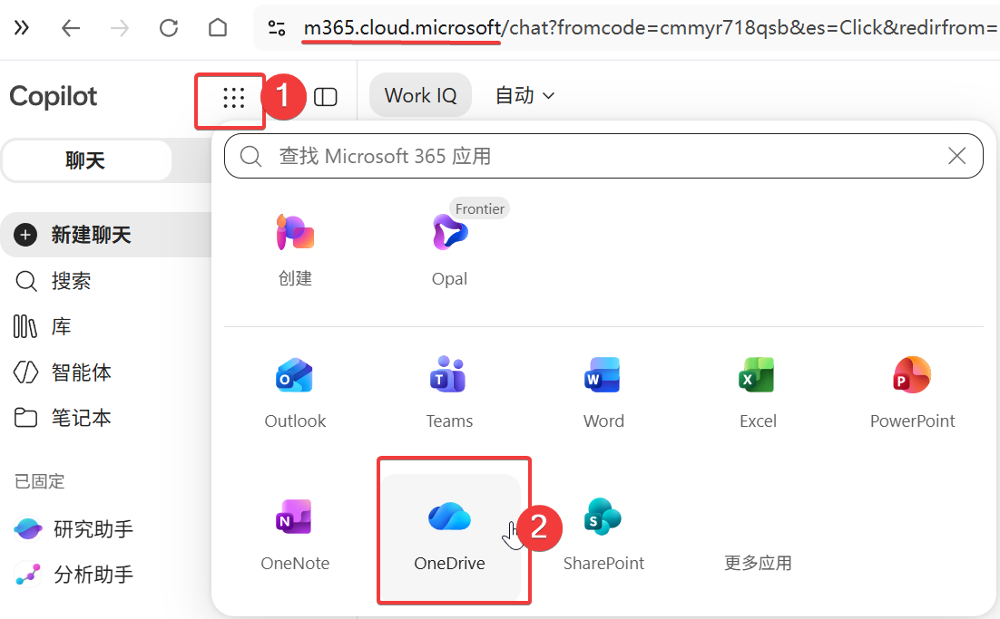
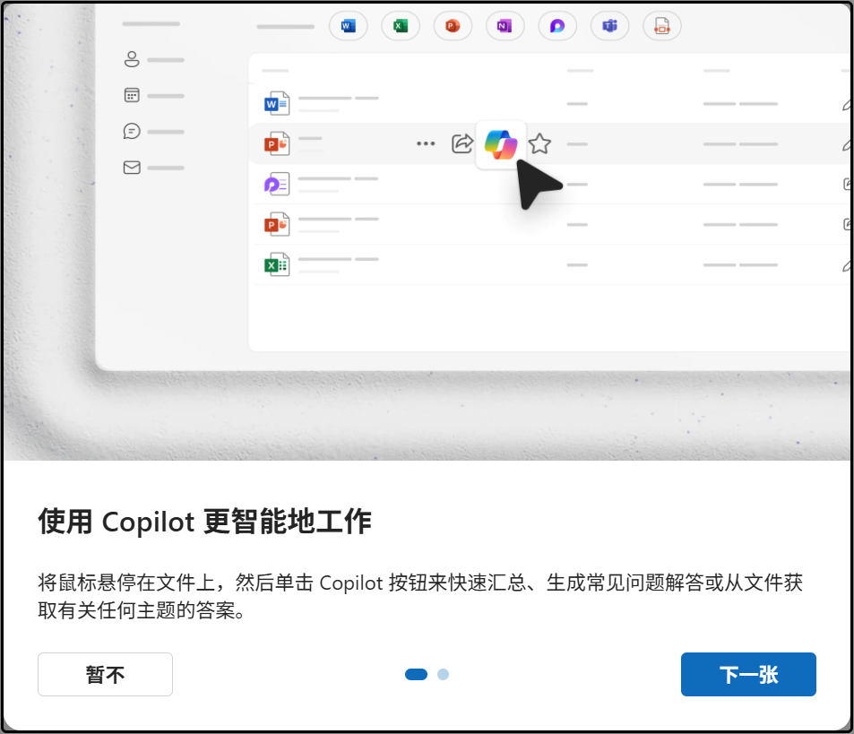
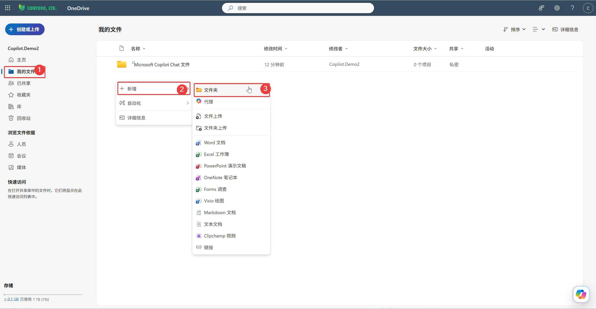
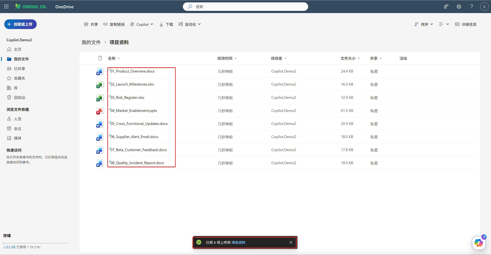
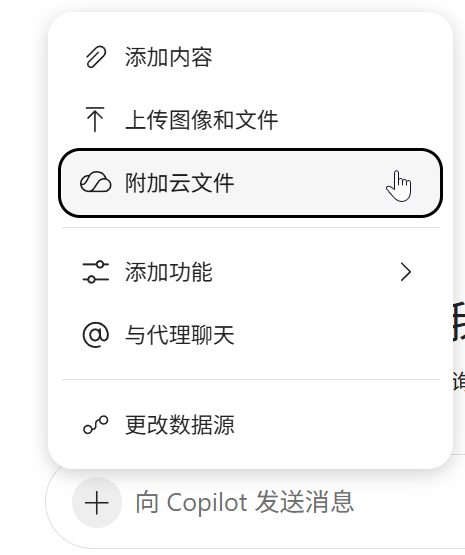
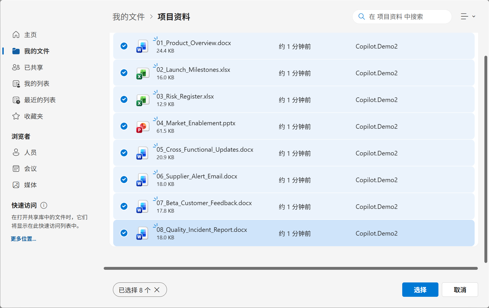
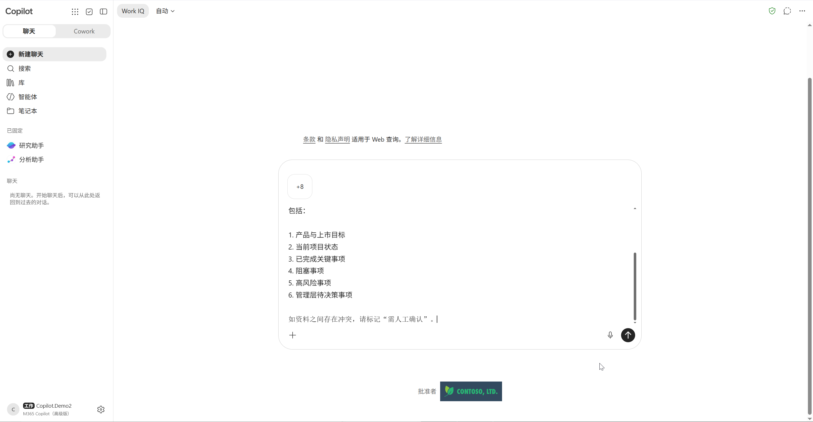
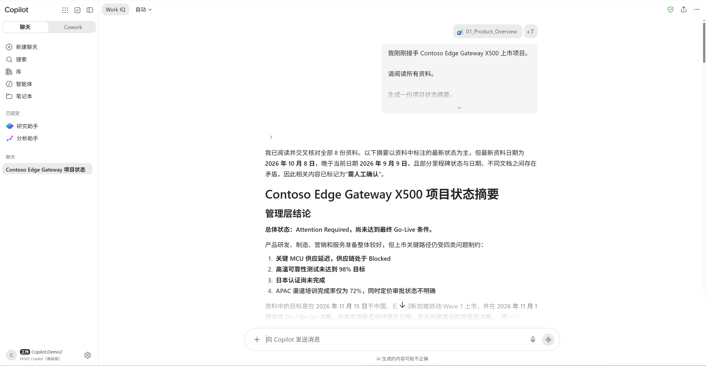
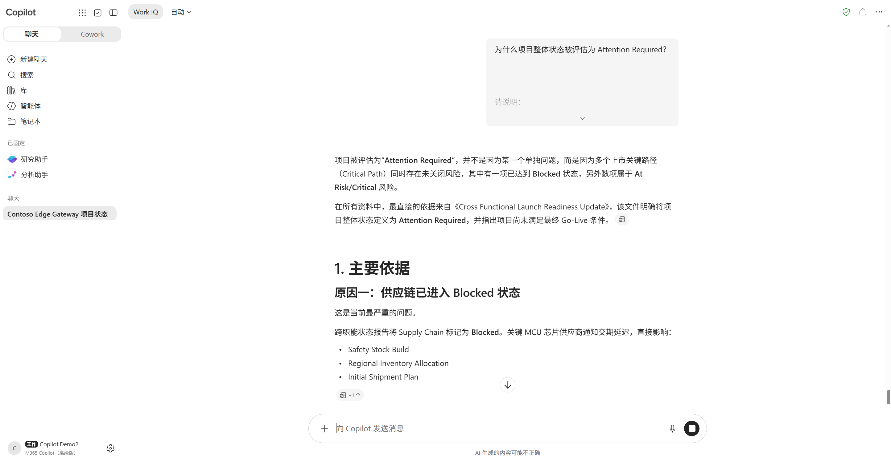

---
lab:
    title: 实验 02 - 使用 Microsoft 365 Copilot 理解业务
    description: 使用 Microsoft 365 Copilot 分析智能制造新品上市项目资料，学习如何从 Chat 走向 Agent，再走向 Cowork。
    duration: 45 分钟
    level: 200
    islab: true
---

# 实验 02 - 利用 Microsoft 365 Copilot 接管你的日常工作

## 实验目标

在上一实验中，您已经识别出了多个 Agent Opportunity。

但是，在创建 Agent 之前，首先需要深入理解业务。

在本实验中，您将扮演 Launch Readiness Program Manager，通过 Microsoft 365 Copilot：

- 理解复杂业务背景
- 分析项目风险
- 发现问题之间的关联
- 理解 Agent 的价值
- 逐步完成从 Chat → Agent → Cowork 的思维转变

完成本实验后，您将能够：

- 使用 Copilot Chat 快速理解业务
- 使用 Copilot 进行跨文件分析
- 在 Word、Excel、PowerPoint 和邮件场景中使用 Copilot
- 识别重复性工作
- 判断哪些工作应交给 Agent
- 理解 Cowork 的应用场景

---

## 场景背景

您是：

Amanda Chen
Launch Readiness Program Manager

负责：

- 新品上市项目管理
- 风险管理
- 跨部门协调
- 管理层汇报

今天上午，项目发起人 James 向您发送了一条消息：

> Amanda，
>
> 下周将召开 Launch Readiness Review。
>
> 请评估项目当前状态，并准备管理层评审材料。
>
> James

然而，此时您刚刚接手项目。

项目团队已经提供了以下资料：

| 文件 | 内容 |
| --------| -------- |
| 01_Product_Overview.docx | 产品介绍 |
| 02_Launch_Milestones.xlsx | 里程碑计划 |
| 03_Risk_Register.xlsx | 风险登记表 |
| 04_Market_Enablement.pptx | 市场赋能资料 |
| 05_Cross_Functional_Updates.docx | 部门周报 |
| 06_Supplier_Alert_Email.docx | 供应商延期通知 |
| 07_Beta_Customer_Feedback.docx | 客户反馈 |
| 08_Quality_Incident_Report.docx | 质量异常报告 |

您的第一项任务：

快速了解项目现状。

---

## Exercise 1 - 使用 Copilot Chat 快速理解项目

### 任务目标

利用 Microsoft 365 Copilot Chat 快速了解项目整体状态。

---

### Step 0 - 准备工作

在开始实验之前，你需要通过 Web 访问 Microsoft 365。可使用以下主要入口之一：

- 主门户: <https://m365.cloud.microsoft/>
- 全部应用: <https://m365.cloud.microsoft/apps/>

你也可以通过以下链接直接访问单个应用：

- OneDrive: <https://onedrive.cloud.microsoft/>
- Word: <https://word.cloud.microsoft/>
- Excel: <https://excel.cloud.microsoft/>
- PowerPoint: <https://powerpoint.cloud.microsoft/>
- Outlook: <https://outlook.office.com/>


确保您已经：

- 登录 Microsoft 365
- 打开 Microsoft 365 Copilot Chat
- 下载好引用项目相关文件

- 然后进入9宫格，打开并进入 “OneDrive”.

    
- 跳过指引内容。

    

- 新建文件夹： **“项目资料”**。
  
  

- 将项目相关文件已经上传至 OneDrive。
- 确认所有文件已成功上传至 OneDrive。

    


---

### Step 1 - 打开 Copilot Chat 并引用项目文件

1. 打开 Microsoft 365 Copilot Chat。

2. 引用以下全部文件：

```text
01_Product_Overview.docx
02_Launch_Milestones.xlsx
03_Risk_Register.xlsx
04_Market_Enablement.pptx
05_Cross_Functional_Updates.docx
06_Supplier_Alert_Email.docx
07_Beta_Customer_Feedback.docx
08_Quality_Incident_Report.docx
```



对话框中输入：

```text
我刚刚接手 Contoso Edge Gateway X500 上市项目。

请阅读所有资料。

生成一份项目状态摘要。

包括：

1. 产品与上市目标
2. 当前项目状态
3. 已完成关键事项
4. 阻塞事项
5. 高风险事项
6. 管理层待决策事项

如资料之间存在冲突，请标记“需人工确认”。
```



---

### Step 2 - 查看 Copilot 输出

查看 Copilot 输出。



思考：

- 目前项目状态是什么？
- 哪些工作流存在风险？
- 哪些问题可能影响上市？

记录结果：

```text
当前项目状态：

_____________________

最重要风险：

_____________________

待决策事项：

_____________________
```

---

## Exercise 2 - 调查问题根因

### 任务目标

不要满足于“发现问题”。

尝试找到问题之间的关联。

---

### Step 1 - 询问项目整体状态

继续向 Copilot 提问：

```text
为什么项目整体状态被评估为 Attention Required？

请说明：

1. 主要依据
2. 涉及哪些文件
3. 对上市可能产生的影响
```



---

### Step 2 - 调查供应链问题

继续提问：

```text
供应链问题将影响哪些项目里程碑？

请说明：

1. 涉及哪些工作流
2. 会影响哪些关键节点
3. 哪些风险会被放大
```

---

### Step 3 - 调查质量异常影响

继续提问：

```text
质量异常是否已经影响客户？

请结合：

07_Beta_Customer_Feedback
08_Quality_Incident_Report

说明：

1. 是否发现关联
2. 有哪些共同问题
3. 应向管理层关注什么
```

---

### 思考

在这个过程中：

您做了什么？

```text
阅读文件
分析信息
寻找关联
发现问题
```

那么如果每天都要重复这些工作，该怎么办？

---

## Exercise 3 - 在 Microsoft 365 应用中完成工作

### 任务目标

理解 Microsoft 365 Copilot 不只存在于 Chat 中，也可以嵌入 Amanda 已经使用的应用，帮助她直接完成日常工作。

### Step 1 - 在 Word 中整理管理层摘要

打开 `05_Cross_Functional_Updates.docx`，使用 Copilot：

```text
请根据本文档内容，整理一份 Launch Readiness Review 管理层摘要。
按“进展、风险、阻塞事项、需要决策、下一步行动”分组。
不要补充文档中没有的事实；无法确认的内容请标记“需人工确认”。
```

检查：摘要是否保留了原文依据，是否适合直接提供给管理层阅读？

### Step 2 - 在 Excel 中分析里程碑和风险

打开 `02_Launch_Milestones.xlsx` 和 `03_Risk_Register.xlsx`，使用 Copilot：

```text
请分析当前里程碑和风险登记表。
找出已经延期、即将到期或受到 Critical / High Risk 影响的里程碑。
列出项目、风险、影响、责任人和建议跟进动作；缺失信息请标记“需人工确认”。
```

检查：是否能把风险与具体里程碑关联起来？哪些结论仍需要 Amanda 确认？

### Step 3 - 在 PowerPoint 中准备评审材料

打开 `04_Market_Enablement.pptx`，使用 Copilot：

```text
请根据当前演示文稿内容，提出 Launch Readiness Review 的 3 页结构：
项目状态、关键风险与管理层待决策事项。
每页给出标题和要点，不要编造数据或上市结论。
```

### Step 4 - 在邮件场景中处理供应商更新

打开 `06_Supplier_Alert_Email.docx`，将其视为收到的供应商邮件，使用 Copilot：

```text
请总结这封供应商更新邮件，说明延期事项、受影响的里程碑、潜在风险和需要跟进的对象。
请生成一封发送给项目团队的行动邮件草稿，但不要代替我发送。
```

### 思考

记录 Copilot 在不同应用中帮助您完成的工作：

```text
Word 完成了：

Excel 完成了：

PowerPoint 完成了：

邮件处理完成了：
```

---

## Exercise 4 - 自主体验 Microsoft 365 Copilot

### 任务目标

选择至少两个场景完成体验。除了完成指定任务，也可以使用自己的工作文件，观察 Copilot 如何帮助您起草、分析、转换和沟通信息。

> 请只使用不包含敏感信息的文件。Copilot 生成的内容需要人工检查，不要直接发送邮件、批准风险或发布结论。

### 体验 A - Word：改写和生成内容

打开 `01_Product_Overview.docx`，选择一段内容并尝试：

```text
请将这段内容改写成面向管理层的 5 条要点。
保留原始事实，删除重复表达，并标记需要进一步确认的信息。
```

然后继续尝试：

```text
请根据当前内容生成一份 FAQ，包含问题、简短回答和依据。
不要补充文档中没有的信息。
```

观察：Copilot 是否能改变表达方式，同时保留原文含义？

### 体验 B - Excel：分析、公式和可视化

打开 `02_Launch_Milestones.xlsx`，任选一项任务：

```text
请找出延期或即将到期的里程碑，并说明判断依据。
```

```text
请建议一个适合展示各工作流状态的图表，并说明图表应使用哪些字段。
不要修改原始数据。
```

如果 Copilot 建议了公式或创建了图表，请检查：字段是否正确、筛选条件是否完整、日期和状态是否被正确解释。

### 体验 C - PowerPoint：从资料生成演示结构

打开 `04_Market_Enablement.pptx`，任选一项任务：

```text
请把当前演示文稿改写成面向管理层的 5 页 Launch Readiness Review。
每页包含标题、3 条以内要点和需要确认的事实。
```

```text
请总结这份演示文稿，并提出一页“管理层需要知道什么”的内容。
不要生成上市批准结论。
```

观察：从已有内容生成结构，和从零开始生成内容有什么不同？

### 体验 D - Outlook：邮件摘要和回复草稿

使用 `06_Supplier_Alert_Email.docx` 模拟一封收到的供应商邮件，尝试：

```text
请将这封邮件整理成：事实、影响、需要跟进的对象、截止日期和待确认问题。
```

然后生成回复草稿：

```text
请起草一封专业、简洁的回复邮件，向供应商确认延期原因、恢复计划和新的交付日期。
语气保持合作，不要承诺尚未批准的事项。
```

观察：Copilot 可以起草邮件，但哪些内容必须由 Amanda 确认后才能发送？

### 体验 E - 跨应用：同一信息的多种表达

选择一个已分析的风险，尝试让 Copilot 分别生成：

```text
请将这个风险分别整理成：
1. 项目经理行动项
2. 管理层 PowerPoint 要点
3. 发给项目团队的邮件段落
要求三种表达使用相同事实，不要改变风险等级或责任归属。
```

记录体验结果：

```text
我体验的应用：

Copilot 帮我完成了：

最有价值的能力：

仍然需要人工检查的内容：
```

这些观察将在下一实验中用于判断：哪些工作只是一次性使用 Copilot，哪些工作已经形成可重复的业务流程。

---

下一实验将继续分析刚才发现的重复步骤，判断哪些工作适合交给 Agent，并设计第一个业务 Agent。

---

## 实验总结

在本实验中，您扮演了 Launch Readiness Program Manager（上市项目负责人），体验了 Microsoft 365 Copilot 如何帮助快速理解复杂业务场景。

通过分析新品上市项目资料，您已经学会：

✅ 使用 Copilot Chat 快速理解业务背景

✅ 从多个文件中提取关键事实

✅ 在 Word、Excel、PowerPoint 和 Outlook 邮件场景中完成任务

✅ 自主体验 Copilot 的改写、分析、生成、可视化和跨应用表达能力

✅ 分析项目风险与依赖关系

✅ 发现跨文件之间的关联

✅ 识别影响新品上市的关键风险

✅ 从日常工作中发现 Agent Opportunity

✅ 理解 Chat、Agent 与 Cowork 的区别

---

### 本实验关键收获

在企业中，很多工作都属于：

- 高频执行
- 规则明确
- 涉及大量信息整理
- 需要跨多个数据来源分析

这些工作非常适合交给 Agent。

而以下工作通常仍然需要人工完成：

- 管理层决策
- 风险批准
- 上市审批
- 商业责任确认

因此：

> Agent 的目标不是替代人，而是减少重复工作，让人把时间投入在更高价值的决策中。

---

### Chat、Agent 与 Cowork 的区别

| 能力 | Chat | Agent | Cowork |
|--------|--------|--------|--------|
| 回答问题 | ✅ | ✅ | ✅ |
| 多文件分析 | ✅ | ✅ | ✅ |
| 自动执行任务 | ❌ | ✅ | ✅ |
| 长时间持续运行 | ❌ | ✅ | ✅ |
| 管理多个任务 | ❌ | ⚠️ | ✅ |
| 协调多个 Agent | ❌ | ❌ | ✅ |
| 完整业务流程执行 | ❌ | ⚠️ | ✅ |

---

### 企业采用路径

本次 workshop 采用以下 Agentic AI 实践路径：

```text
业务流程
↓
Copilot Chat
↓
Agent Opportunity
↓
Business Agent
↓
Multiple Agents
↓
Cowork
↓
Business Transformation
```

## 下一步

我们将进入：

➡ [实验 03 - 发现 Gap 与构建路径](./Lab03-Find-Gap.html)
