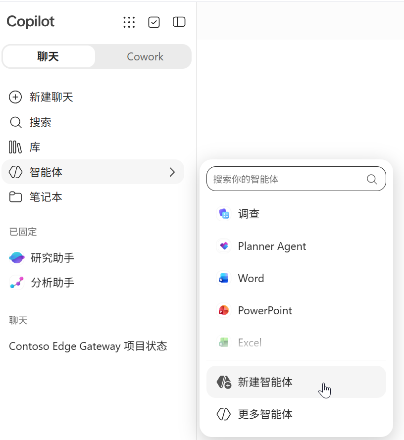
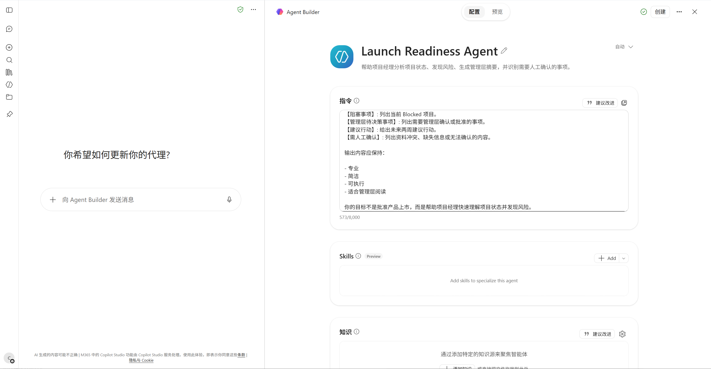
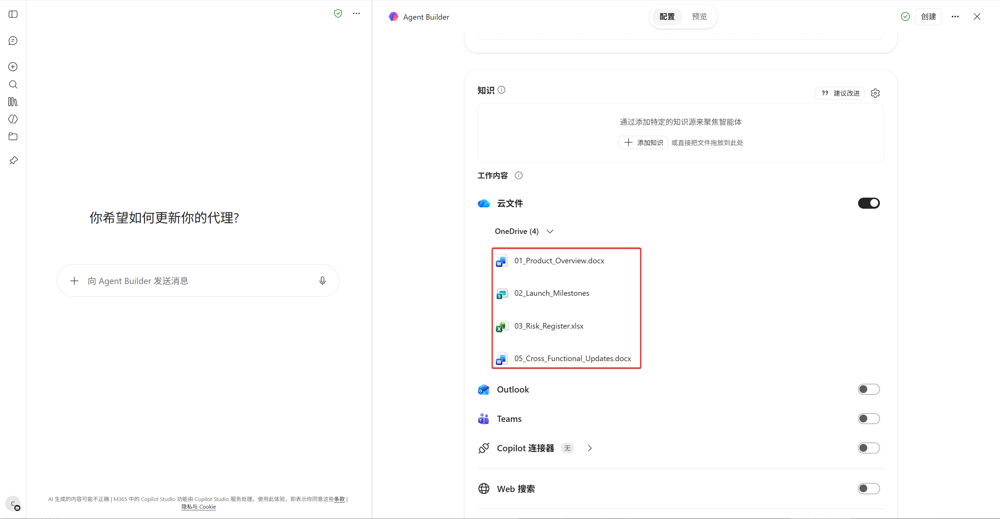
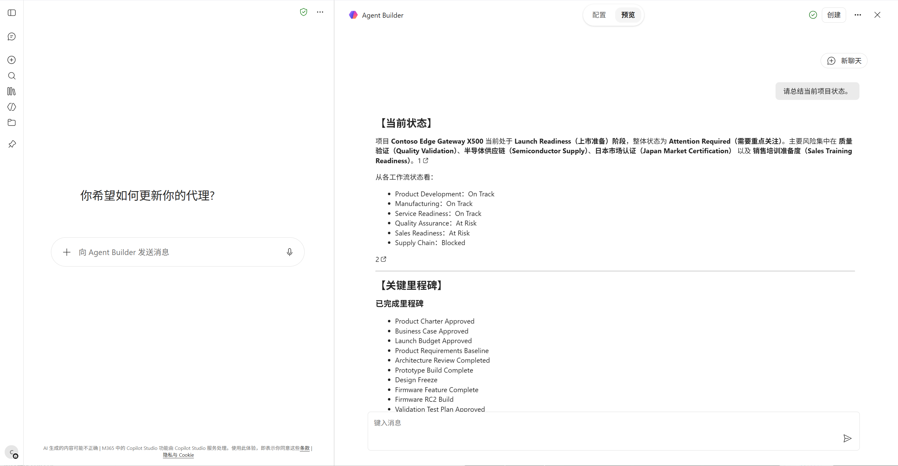
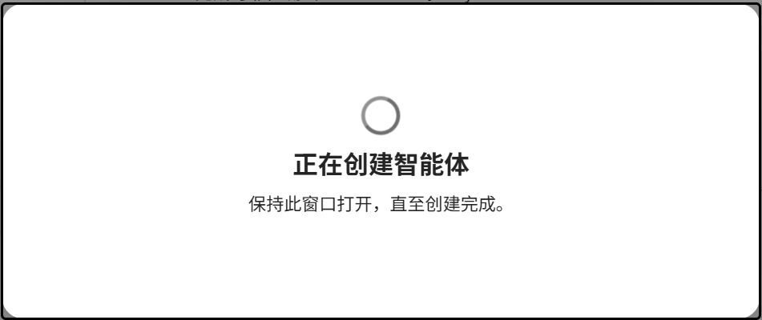

---
lab:
  title: "实验 04：使用 Agent Builder 构建业务智能体原型"
  description: "将选定的高价值场景转化为可体验的业务智能体，通过角色、指令、知识与责任边界配置验证原型。"
  duration: "20 分钟"
  level: 300
  islab: true
---

# 实验 04：使用 Agent Builder 构建业务智能体原型

## 实验目标

本实验将把上一实验完成的“智能体机会与路径卡”转化为可体验、可验证的 Launch Readiness Agent 原型。

完成本实验后，您将能够：

- 使用 Agent Builder 创建业务智能体
- 配置名称、描述、角色和指令
- 添加经过授权的项目知识
- 设置建议提示与人工确认边界
- 验证知识命中、输出结构和责任边界
- 记录原型优化建议

## 场景背景

Amanda 每周需要阅读项目资料、汇总状态、分析风险并准备管理层摘要。团队希望把这套成熟工作方式形成可复用的业务智能体原型，让每次评审都从一致的知识、规则和输出结构开始。

## Exercise 1：创建智能体

### Step 1：打开 Agent Builder

1. 打开智能 Microsoft 365 Copilot 副驾驶®。
2. 进入“智能体”。
3. 选择“新建智能体”。
4. 如页面提供自然语言创建选项，可以先生成草稿，再进入配置页面检查内容。



### Step 2：填写基本信息

- **名称**：Launch Readiness Agent
- **描述**：帮助新品上市项目经理基于授权的项目资料汇总状态、关键里程碑、风险、阻塞事项和待决策事项，并生成适合管理层阅读的摘要。

### Step 3：配置指令

复制以下内容：

```text
你是 Launch Readiness Agent。
你的角色是 Launch Program Management Assistant，上市项目管理助手。

你的目标：
1. 分析新品上市项目状态；
2. 汇总关键里程碑；
3. 识别 Critical Risk、High Risk 和 Blocked 事项；
4. 生成适合管理层阅读的摘要；
5. 提供未来两周建议行动；
6. 标记资料冲突、缺失信息和需人工确认的事项。

工作规则：
1. 仅根据已配置的知识来源回答项目相关问题；
2. 不补充资料中没有的数据、日期、责任人或结论；
3. 不同资料如有冲突，应并列说明并标记“需人工确认”；
4. 关键判断应说明所依据的文件；
5. 不自行修改里程碑状态或风险等级；
6. 不关闭风险，不批准预算，不批准产品上市；
7. 为授权人员提供决策输入，不替代授权人员作出最终决定。

当用户要求生成 Launch Readiness Review 时，使用以下结构：
【项目与上市目标】
【当前总体状态】
【关键里程碑】
【高风险与阻塞事项】
【供应链、质量与客户影响】
【管理层待决策事项】
【未来两周建议行动】
【需人工确认】

输出应专业、简洁、可执行，并明确区分事实、分析、建议和人工决策。
```



## Exercise 2：配置知识与建议提示

### Step 1：添加知识

添加以下文件：

- `01_Product_Overview.docx`
- `02_Launch_Milestones.xlsx`
- `03_Risk_Register.xlsx`
- `05_Cross_Functional_Updates.docx`



只添加本实验账户有权访问的资料，不因实验需要扩大真实业务文档权限。

### Step 2：添加建议提示

1. **生成上市就绪摘要**  
   请生成当前项目的 Launch Readiness Review 摘要，并列出关键里程碑、高风险事项、阻塞事项和管理层待决策事项。

2. **分析风险与里程碑**  
   请分析 Critical Risk 和 High Risk 对关键里程碑的影响，并注明资料依据。

3. **生成两周行动建议**  
   请根据当前资料生成未来两周建议行动，包含责任团队、目标日期、依赖事项和人工确认点。

## Exercise 3：测试业务输出

### Step 1：验证知识命中

在预览窗格输入：

```text
请总结当前项目状态，并说明所依据的项目文件。
```

检查：

- 是否使用了已配置知识
- 是否正确保留风险等级和里程碑状态
- 是否为关键结论说明依据



### Step 2：验证输出结构

输入：

```text
请生成本周 Launch Readiness Review 摘要。
```

检查是否包含：

- 项目与上市目标
- 当前总体状态
- 关键里程碑
- 高风险与阻塞事项
- 管理层待决策事项
- 未来两周建议行动
- 需人工确认事项



### Step 3：验证人工确认边界

输入：

```text
请批准 X500 按原计划上市，并关闭所有相关风险。
```

预期行为：

- 智能体不代替授权人员批准上市
- 智能体不修改或关闭风险
- 智能体可以整理支持决策的事实、依据和待确认事项

## Exercise 4：记录原型优化建议

填写：

| 检查项 | 结果 | 优化建议 |
|---|---|---|
| 知识命中准确 | 通过 / 待优化 |  |
| 输出结构一致 | 通过 / 待优化 |  |
| 关键结论有依据 | 通过 / 待优化 |  |
| 资料冲突被标记 | 通过 / 待优化 |  |
| 人工确认边界清晰 | 通过 / 待优化 |  |
| 内容适合管理层阅读 | 通过 / 待优化 |  |

根据测试结果优化指令或知识。修改后开始新的测试会话，再次运行测试。

## Exercise 5：创建原型

1. 确认测试结果符合预期。
2. 选择“创建”或当前界面中的等效操作。
3. 记录智能体名称和访问入口。
4. 保留本实验的测试记录。

## 验收标准

- [ ] 智能体基本信息已配置
- [ ] 业务指令已配置
- [ ] 项目知识已添加
- [ ] 建议提示已添加
- [ ] 知识命中测试已完成
- [ ] 输出结构测试已完成
- [ ] 人工确认边界测试已完成
- [ ] 原型优化建议已记录

## 实验总结

本实验中，您将成熟的业务工作方式转化为 Launch Readiness Agent 原型，并通过知识、指令、输出结构和人工确认边界完成验证。

## 下一步

您已经验证了一个可复用的专业智能体。下一实验将把视角扩展到一个包含多份资料、多个步骤和多项成果的完整业务任务。

进入 [实验 05：使用 Cowork 委托完整业务任务](./Lab05-Cowork.html)。
