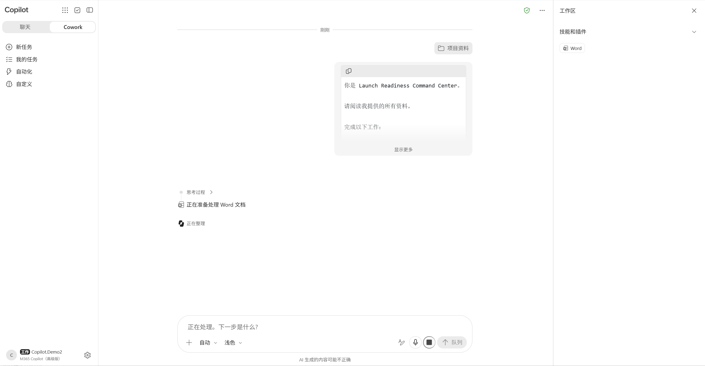
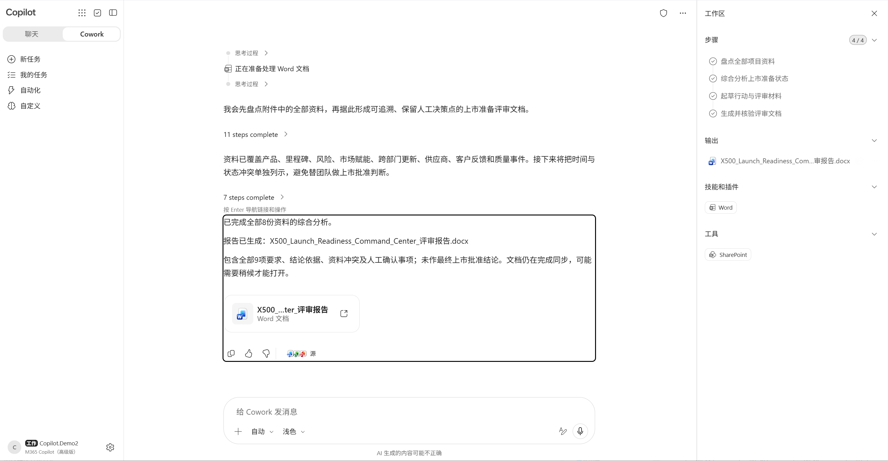
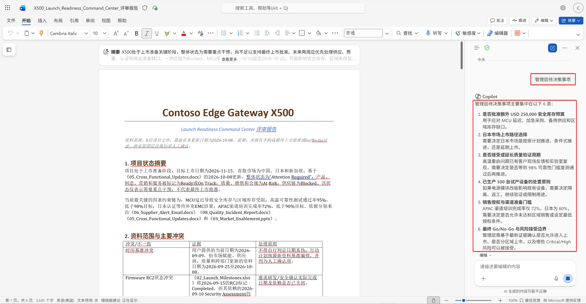
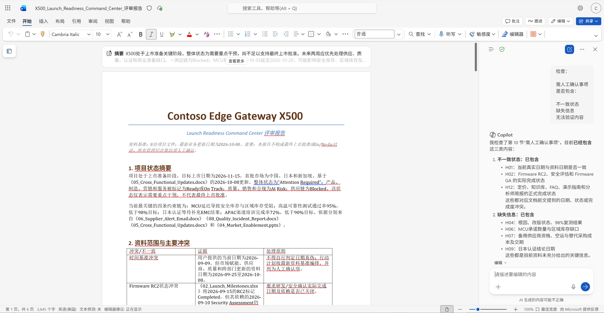

---
lab:
    title: 实验 05 - 使用 Cowork 构建 Launch Readiness Command Center
    description: 使用 Cowork 统筹多个业务任务，完成从项目状态分析到管理层汇报材料生成的完整业务流程。
    duration: 45 分钟
    level: 300
    islab: true
---

# 实验 05 - 使用 Cowork 构建 Launch Readiness Command Center

## 实验目标

在前面的实验中，您已经体验了：

✅ 使用 Copilot Chat 分析业务

✅ 发现 Agent Opportunity

✅ 使用 Agent Builder 创建 Launch Readiness Agent

但是，一个问题仍然存在：

项目经理 Amanda 仍然需要：

- 提问
- 触发 Agent
- 汇总结果
- 编写报告

如果需要完成完整业务流程：

```text
状态分析
↓
风险分析
↓
供应商分析
↓
行动计划
↓
管理层汇报
```

是否能够一次完成？

这正是 Cowork 提供的价值。

完成本实验后，您将能够：

- 理解 Cowork 的工作方式
- 使用 Cowork 协调多个任务
- 理解 Multi-Agent 协同模式
- 完成完整业务流程委托

---

## 场景背景

今天下午。

Amanda 收到 CEO 的紧急要求。

```text
Amanda，

请在今晚前完成：

1. 项目状态总结
2. 风险分析
3. 管理层简报大纲
4. 行动邮件草稿
5. 需人工确认事项

我希望看到完整结果。

James
```

Amanda 想：

```text
如果这些工作都要手工完成，
即使有 Chat 和 Agent，
仍然需要大量人工整理。
```

因此 Amanda 决定：

使用 Cowork。

---

## Exercise 1 - 理解 Cowork

### Step 1 - 回顾前面完成的工作

回顾前面完成的工作。

请思考：

如果使用 Chat：

```text
需要不断提问
```

如果使用 Agent：

```text
需要分别运行多个 Agent
```

那么：

```text
如果要完成完整业务流程，
应该怎么办？
```

---

### Step 2 - 识别业务流程中的任务

讨论：

以下哪些工作属于同一个业务流程？

- 项目状态汇总
- 风险分析
- 供应商分析
- 客户反馈分析
- 管理层简报准备
- 行动邮件生成

答案：

```text
Launch Readiness Review
```

---

## Exercise 2 - 创建 Cowork 任务

### Step 1 - 打开 Cowork

打开：

```text
Microsoft 365 Copilot
```

进入：

```text
Cowork
```

（或由讲师演示当前租户中的 Cowork 功能）

---

### Step 2 - 创建 Cowork 任务

创建任务：

```text
Launch Readiness Command Center
```

---

### Step 3 - 添加资料来源

添加资料来源，点击加号，选择附加云文件和文件夹。

选择：

```text
01_Product_Overview.docx

02_Launch_Milestones.xlsx

03_Risk_Register.xlsx

04_Market_Enablement.pptx

05_Cross_Functional_Updates.docx

06_Supplier_Alert_Email.docx

07_Beta_Customer_Feedback.docx

08_Quality_Incident_Report.docx
```

或者将项目资料文件夹，附加到这里。

---

## Exercise 3 - 委托完整业务流程

### Step 1 - 委托完整业务流程

将以下任务交给 Cowork。

```text
你是 Launch Readiness Command Center。

请阅读我提供的所有资料。

完成以下工作：

1. 生成项目状态摘要

2. 总结关键工作流状态

3. 分析主要风险

4. 分析供应链风险

5. 分析质量问题影响

6. 生成未来两周行动计划

7. 生成管理层评审大纲

8. 起草跨部门行动邮件

9. 输出需人工确认事项

工作规则：

- 必须说明结论依据
- 必须标记资料冲突
- 不允许编造信息
- 不允许做最终上市批准结论
- 所有管理层决策必须保留人工确认
```



---

### Step 2 - 观察 Cowork 输出

观察 Cowork 输出。

关注：

- 是否自动拆解任务
- 是否形成多个步骤
- 是否引用多个资料来源
- 是否发现冲突



---

## Exercise 4 - 人工干预 (Human In The Loop)

### 背景

Agent 与 Cowork 并不能替代管理层。

Amanda 需要：

审核所有关键结论。

---

### Step 1 - 审核管理层待决策事项

请检查：

Cowork 输出中的：

```text
管理层待决策事项
```

是否包含：

- 日本市场发布日期
- 安全库存决策
- 额外可靠性验证

1. 检查生成内容，或者点击生成好的评审报告，点击从OneDrive打开文件。
2. 打开右下角Copilot按钮，查看管理层待决策事项。



---

### Step 2 - 审核需人工确认事项

检查：

```text
需人工确认事项
```

是否包含：

- 不一致状态
- 缺失信息
- 无法验证内容



---

### Step 3 - 讨论必须人工确认的内容

讨论

哪些内容必须由人确认？

```text
______________________
```

---

## Exercise 5 - 从 Agent 到 Command Center

### Step 1 - 回顾整个 Workshop

回顾整个 Workshop。

请完成下表：

| 阶段 | 目标 |
|--------|--------|
| Copilot Chat | 理解业务 |
| Agent | 自动执行单项任务 |
| Cowork | 完成完整业务流程 |

---

### Step 2 - 思考未来扩展

思考：

如果未来继续扩展。

除了：

```text
Launch Readiness Agent
```

还能增加哪些 Agent？

示例：

```text
Risk Monitoring Agent

Supplier Monitoring Agent

Quality Incident Agent

Customer Feedback Agent

Executive Review Agent
```

---

### Step 3 - 讨论 Cowork 的多 Agent 协同能力

讨论

如果这些 Agent 全部完成构建。

Cowork 是否能够：

```text
自动协调多个 Agent？
```

---

## 实验总结

在本实验中，您已经完成：

✅ 使用 Chat 理解业务

✅ 使用 Agent 自动处理重复工作

✅ 使用 Cowork 完成完整业务流程

✅ 理解 Human In The Loop

✅ 构建 Launch Readiness Command Center

---

### 本次 Workshop 的 Agentic AI 演进路径

```text
Lab01
发现 Agent Opportunity
↓
Lab02
利用 Copilot 理解业务
(Chat)
↓
Lab03
发现 Gap 与设计 Agent
(Agent Design)
↓
Lab04
使用 Agent Builder 创建 Agent
(Agent)
↓
Lab05
使用 Cowork 编排业务流程
(Cowork)
```

---

### Amanda 的最终成果

通过 Agent 与 Cowork 的协同：

✅ 项目状态摘要

✅ 风险分析

✅ 管理层汇报材料

✅ 行动邮件

✅ 人工确认清单

已经全部生成。

Amanda 可以把更多时间投入在：

```text
决策
沟通
风险控制
业务创新
```

而不是重复的信息整理工作。

---

恭喜完成：

# 智能制造新品上市
# Launch Readiness Command Center

Agentic AI Workshop