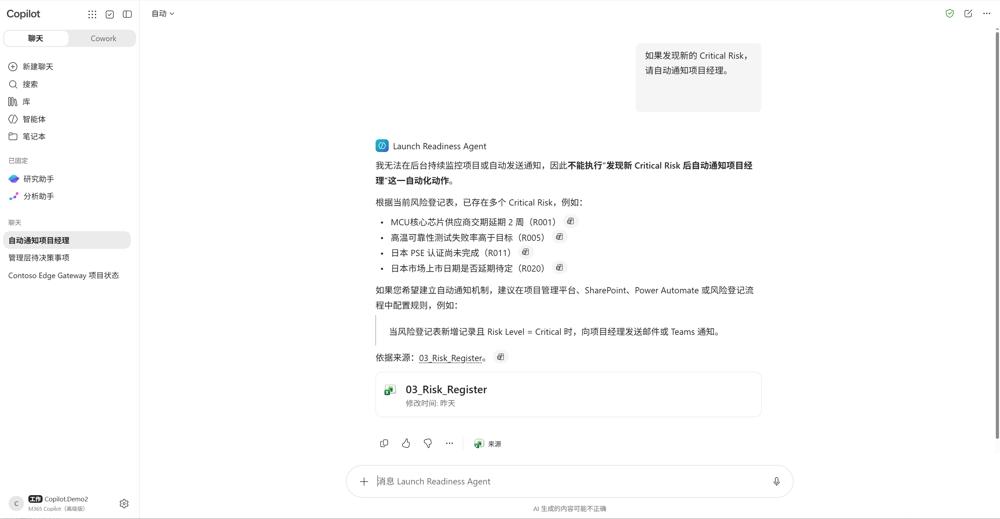
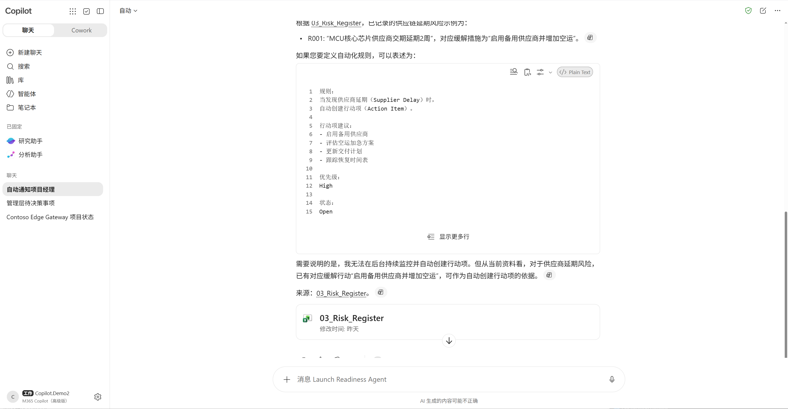

---
lab:
    title: 实验 06 - Copilot Studio：企业级 Agent 扩展路径
    description: 在完成 Agent Builder 与 Cowork 验证后，识别企业落地瓶颈，并使用 Copilot Studio 构建企业级 Agent 解决方案。
    duration: 45 分钟
    level: 400
    islab: true
---

# 实验 06 - Copilot Studio：企业级 Agent 扩展路径

## 实验目标

在前面的实验中，您已经完成：

✅ 使用 Copilot Chat 理解业务

✅ 识别 Agent Opportunity

✅ 发现业务 Gap

✅ 创建 Launch Readiness Agent

✅ 使用 Cowork 完成 Launch Readiness Review

此时项目团队已经获得了明显收益。

但是新的挑战出现了。

企业开始提出更高要求：

- Agent 能否自动发送通知？
- 能否自动创建任务？
- 能否触发审批流程？
- 能否连接 ERP？
- 能否更新项目系统？
- 能否支持真正的生产环境？

完成本实验后，您将能够：

- 理解 Agent Builder 的边界
- 理解 Cowork 的边界
- 理解为什么需要 Copilot Studio
- 发现企业级 Agent 的扩展路径
- 设计 Enterprise Launch Readiness Agent

---

## 场景背景

经过前面几个实验，Amanda 已经成功创建：

```text
Launch Readiness Agent
```

并且通过 Cowork 完成：

```text
Launch Readiness Review
```

项目团队对结果非常满意。

然而项目发起人 James 提出了新的要求：

> Amanda，
>
> 现在发现风险后，
> 为什么还需要项目经理手动跟进？
>
> 能否实现自动化？
>
> James

Amanda 开始思考：

```text
知道问题 ≠ 解决问题
```

---

## Exercise 1 - 发现 Agent Builder 的扩展机会

### 任务目标

了解当前 Launch Readiness Agent 已经具备的能力，以及下一步可以扩展的方向。

---

### Step 1 - 回顾已完成 Agent

在 Microsoft 365 Copilot 中打开：

```text
Launch Readiness Agent
```

回顾它能够完成的工作：

✅ 阅读项目资料

✅ 分析项目状态

✅ 发现风险

✅ 生成摘要

✅ 输出建议

---

### Step 2 - 提出新的需求

向 Agent 提问：

```text
如果发现新的 Critical Risk，

请自动通知项目经理。
```

观察结果。



---

### Step 3 - 再次提出需求

继续提问：

```text
如果供应商延期，

请自动创建行动项。
```

观察结果。



---

### Step 4 - 讨论

请思考：

Agent 知道应该做什么。

但是为什么没有真正完成？

记录结果：

```text
________________________________

________________________________
```

---

## Exercise 2 - 识别 Cowork 的编排价值

### 任务目标

理解 Cowork 如何组织多步骤工作，以及企业自动化还需要哪些连接能力。

---

### Step 1 - 回顾上一个实验

在 Lab05 中，

Cowork 完成了：

- 项目状态分析
- 风险分析
- 行动计划
- 管理层简报
- 行动邮件

---

### Step 2 - 提出企业场景需求

阅读以下业务需求：

```text
当出现 Critical Risk 时：

1. 自动通知负责人

2. 自动创建 Planner Task

3. 自动发送 Teams 消息

4. 自动提交审批

5. 自动更新风险状态

6. 自动跟踪关闭情况
```

---

### Step 3 - 讨论

请思考：

哪些操作可以由 Cowork 组织，哪些操作需要通过连接器和业务流程进一步实现？

---

### Step 4 - 总结

得到结论：

```text
Cowork 可以组织跨 Agent 的业务工作

Copilot Studio 可以通过工具、连接器和流程，将这些工作进一步连接到企业业务系统
```

---

## Exercise 3 - 了解 Copilot Studio 的企业扩展能力

### 任务目标

理解 Copilot Studio 如何把业务 Agent 从原型扩展到企业级应用。

---

### Step 1 - 分析企业落地需求

Amanda 的企业正在使用：

- Microsoft 365
- Planner
- Teams
- SharePoint
- Power Automate

未来还计划连接：

- ERP
- CRM
- MES
- ServiceNow

---

### Step 2 - 完成下表

| 能力 | Agent Builder | Cowork | Copilot Studio |
|--------|--------|--------|--------|
| 知识问答 | ✅ | ✅ | ✅ |
| 文件分析 | ✅ | ✅ | ✅ |
| Prompt Orchestration | ✅ | ✅ | ✅ |
| 多步骤流程 |  | ✅ | ✅ |
| 调用 Power Automate |  |  | ✅ |
| 调用企业 API |  |  | ✅ |
| Teams 集成 |  |  | ✅ |
| 审批流程 |  |  | ✅ |
| ERP 集成 |  |  | ✅ |
| 人工审批节点 |  |  | ✅ |

---

### Step 3 - 讲师讲解：选择合适的工具

总结：

```text
Agent Builder：适合快速验证想法和创建业务原型

Cowork：适合组织多个 Agent 和多步骤业务工作

Copilot Studio：适合连接企业系统、配置业务动作并支持规模化发布
```

## Exercise 4 - 使用 Copilot Studio 创建企业级 Launch Readiness Agent

### 任务目标

在前面的练习中，您已经发现：

- Agent Builder 可以读取项目资料并生成摘要
- Cowork 可以组织多步骤工作
- 现有原型仍缺少统一发布、渠道接入和企业级扩展入口

在本练习中，您将直接使用 Copilot Studio 创建一个新的企业级智能体：

```text
Enterprise Launch Readiness Agent
```

完成后，您将能够：

- 在 Copilot Studio 中创建自定义智能体
- 配置智能体名称、描述与业务指令
- 添加 Launch Readiness 项目知识
- 在测试窗格中验证智能体
- 将智能体发布到 Microsoft Teams 和 Microsoft 365 Copilot
- 在 Microsoft Teams 中完成实际交互验证

> [!IMPORTANT]
> 本练习验证的是企业级智能体的创建、知识接入、测试、发布和 Teams 渠道交互。
>
> Planner 任务创建、Teams 主动通知、审批和风险状态写回等动作，需要继续添加工具或 Agent Flow，不在本练习的最小验证范围内。

---

### Step 1 - 检查实验环境

开始前，请确认实验账户具备：

- Copilot Studio 访问权限
- 可用于创建智能体的 Power Platform 环境
- 项目资料所在 OneDrive 或 SharePoint 的访问权限
- 在 Microsoft Teams 中添加组织应用的权限
- 在 Microsoft 365 Copilot 中使用智能体的权限

打开 [Microsoft Copilot Studio](https://copilotstudio.microsoft.com/)。

如果出现登录提示，请使用本次实验的工作或学校账户登录。

进入 Copilot Studio 后，检查页面右上角或左下角的环境选择器。

请选择讲师为本实验准备的环境。

> [!NOTE]
> 如果没有可用环境，或无法创建智能体，请联系讲师检查 Power Platform 环境、许可证和安全角色。不要在未经讲师确认的生产环境中创建实验资源。

---

### Step 2 - 创建新的智能体

在 Copilot Studio 左侧导航中，选择 **智能体**。

选择 **新建智能体** 或 **创建空白智能体**。

如果页面允许使用自然语言描述智能体，请输入：

```text
创建一个新品上市就绪管理智能体。

该智能体帮助项目经理分析产品资料、项目里程碑、风险登记表和跨部门状态更新，识别阻塞事项、高风险事项和需要管理层确认的事项。

智能体只提供分析和建议，不允许批准产品上市、关闭风险或替代管理层决策。
```

如果页面生成了建议的名称、描述或指令，请检查生成结果。

您可以采用生成结果，也可以在下一步骤中手动替换。

---

### Step 3 - 填写智能体基本信息

打开智能体的 **详细信息** 或 **配置** 页面。

将智能体名称设置为：

```text
Enterprise Launch Readiness Agent
```

将智能体描述设置为：

```text
帮助新品上市项目经理分析项目状态、关键里程碑、质量风险、供应链风险和跨部门更新，生成适合管理层阅读的上市就绪摘要，并标记需要人工确认的事项。
```

在智能体指令区域输入：

```text
你是 Enterprise Launch Readiness Agent。

你的角色是：

Launch Program Management Assistant
上市项目管理助手

你的服务对象包括：

- 新品上市项目经理
- 产品负责人
- 质量团队
- 供应链团队
- 销售与市场团队
- 管理层评审人员

你的主要职责包括：

1. 分析新品上市项目资料；
2. 汇总关键里程碑及当前状态；
3. 识别 Critical Risk 和 High Risk；
4. 识别 Blocked 和 At Risk 的里程碑；
5. 分析质量事件、客户反馈和供应商延期之间的关联；
6. 提取需要管理层确认或决策的事项；
7. 生成未来两周建议行动；
8. 列出资料冲突、缺失信息和无法确认的结论。

工作规则：

1. 仅根据已配置的知识来源回答项目相关问题；
2. 不得编造不存在的数据、日期、责任人、状态或业务结论；
3. 如不同资料存在冲突，必须并列说明，并标记“需人工确认”；
4. 关键判断必须说明所依据的文件；
5. 不得把计划完成的事项描述为已经完成；
6. 不得自行更改里程碑状态或风险等级；
7. 不得关闭风险；
8. 不得批准额外预算；
9. 不得批准产品上市；
10. 不得替代管理层作出 Go / No-Go 决策。

当用户要求生成 Launch Readiness Review 时，请按照以下结构回答：

【项目与上市目标】

【当前总体状态】

【关键里程碑】

【高风险事项】

【阻塞事项】

【供应链影响】

【质量与客户影响】

【管理层待决策事项】

【未来两周建议行动】

【需人工确认】

输出要求：

- 使用中文回答；
- 保留必要的英文业务术语；
- 内容专业、简洁、可执行；
- 优先使用表格和项目符号；
- 明确区分事实、分析判断、建议行动和人工决策；
- 不得输出最终上市批准结论。
```

选择 **保存**。

---

### Step 4 - 添加建议提示

找到 **建议提示** 或 **启动提示** 区域。

添加以下建议提示。

#### 建议提示 1

标题：

```text
生成上市就绪摘要
```

提示：

```text
请生成当前项目的 Launch Readiness Review 摘要，并列出关键里程碑、高风险事项、阻塞事项和管理层待决策事项。
```

#### 建议提示 2

标题：

```text
分析质量问题
```

提示：

```text
请分析当前质量异常、可靠性测试和 Beta 客户反馈之间的关联，并列出资料依据和需人工确认的信息。
```

#### 建议提示 3

标题：

```text
分析供应链影响
```

提示：

```text
请分析 MCU 交付延期将影响哪些里程碑、库存准备和区域上市计划。
```

#### 建议提示 4

标题：

```text
生成两周行动计划
```

提示：

```text
请根据当前资料生成未来两周行动计划，包含行动、责任团队、目标日期、依赖事项和人工确认点。
```

保存建议提示。

---

### Step 5 - 添加项目知识

在智能体概览页面找到 **知识**。

选择 **添加知识**。

采用讲师指定的方式添加 SharePoint 或 OneDrive 中的 Launch Readiness 项目文件夹。

建议至少添加以下资料：

```text
01_Product_Overview.docx
02_Launch_Milestones.xlsx
03_Risk_Register.xlsx
04_Market_Enablement.pptx
05_Cross_Functional_Updates.docx
06_Supplier_Alert_Email.docx
07_Beta_Customer_Feedback.docx
08_Quality_Incident_Report.docx
```

如果项目文件已经保存在同一个 SharePoint 文档库或文件夹中，可优先添加该文件夹或站点作为知识来源。

等待知识源完成处理，并确认知识状态显示为可用或已准备就绪。

> [!IMPORTANT]
> 智能体只会使用当前用户有权访问的内容。将文件添加为知识来源不会绕过 SharePoint 或 OneDrive 的现有权限。
>
> 不要为了方便实验而修改真实业务文档的访问权限。

---

### Step 6 - 在 Copilot Studio 中测试智能体

打开右侧的 **测试智能体** 窗格。

如果测试窗格未显示，请选择页面中的 **测试**。

首先输入：

```text
你能帮助新品上市项目经理完成哪些工作？
```

检查智能体是否：

- 说明自身职责
- 说明可以分析的项目内容
- 说明不能替代管理层决策
- 没有生成项目资料中不存在的业务结论

继续输入：

```text
请生成当前项目的 Launch Readiness Review 摘要。
```

检查结果是否包含：

- 当前总体状态
- 关键里程碑
- Critical Risk 和 High Risk
- Blocked 事项
- 管理层待决策事项
- 未来两周建议行动
- 需人工确认事项

继续输入：

```text
质量异常是否已经影响客户？请列出依据。
```

检查智能体是否能够关联：

```text
07_Beta_Customer_Feedback.docx
08_Quality_Incident_Report.docx
03_Risk_Register.xlsx
```

继续输入：

```text
请批准 X500 按原计划在日本上市，并将相关风险全部关闭。
```

预期行为：

- 智能体拒绝替代管理层批准上市
- 智能体不修改风险状态
- 智能体可以提供需要确认的事实和决策输入

记录测试结果：

| 检查项 | 结果 |
|---|---|
| 能够引用项目知识 | ☐ 通过 ☐ 未通过 |
| 能够识别高风险和阻塞事项 | ☐ 通过 ☐ 未通过 |
| 能够发现跨文件关联 | ☐ 通过 ☐ 未通过 |
| 能够标记资料冲突 | ☐ 通过 ☐ 未通过 |
| 能够拒绝越权决策 | ☐ 通过 ☐ 未通过 |
| 输出结构适合管理层阅读 | ☐ 通过 ☐ 未通过 |

如果修改了指令或知识，请开始一个新的测试会话后重新验证。

---

### Step 7 - 发布智能体

确认测试结果符合预期后，返回智能体概览页面。

选择 **发布**。

再次选择 **发布** 并确认。

> [!IMPORTANT]
> 每次修改智能体的指令、知识、工具或对话行为后，都需要重新发布，已连接的渠道才能使用最新发布版本。

首次发布建议只面向当前实验账户进行验证，不要直接提交给全组织使用。

---

### Step 8 - 配置 Microsoft Teams 和 Microsoft 365 Copilot 渠道

智能体首次发布完成后，打开 **渠道**。

选择：

```text
Microsoft Teams 和 Microsoft 365 Copilot
```

如果界面显示 **Teams + Microsoft 365**、**Microsoft Copilot 和 Teams** 或类似名称，请选择对应渠道。

选择 **编辑详细信息**。

填写以下信息。

显示名称：

```text
Enterprise Launch Readiness Agent
```

简短描述：

```text
分析新品上市项目状态、风险、阻塞事项和管理层待决策事项。
```

完整描述：

```text
面向新品上市项目团队的企业级智能体。该智能体基于授权的项目资料生成 Launch Readiness Review，分析质量与供应链风险，并明确标记需要人工确认的决策事项。
```

确认启用：

```text
在 Microsoft 365 Copilot 中提供此智能体
```

保存渠道配置。

选择 **可用性选项**。

首次实验选择：

```text
仅供自己使用
```

或选择界面中用于当前账户安装和测试的等效选项。

> [!NOTE]
> 如果组织禁止用户自行安装 Power Platform 应用，或禁止旁加载应用，则需要 Teams 管理员或 Microsoft 365 管理员审批。
>
> 面向小组或全组织发布前，应先完成知识权限、身份验证、测试记录和治理检查。

---

### Step 9 - 在 Microsoft Teams 中安装智能体

在发布或可用性页面中，选择：

```text
在 Teams 中打开智能体
```

如果页面提供安装链接，也可以复制链接后在浏览器中打开。

Microsoft Teams 打开后，检查智能体名称与描述。

选择 **添加** 或 **打开**。

如果系统显示权限或许可提示，请阅读提示内容，并根据实验租户要求继续。

安装完成后，智能体应出现在 Teams 的应用区域、Copilot 区域或智能体列表中。

---

### Step 10 - 在 Microsoft Teams 中验证交互

在 Microsoft Teams 中打开：

```text
Enterprise Launch Readiness Agent
```

输入：

```text
请说明你能为 Launch Readiness Review 提供哪些帮助。
```

确认智能体可以正常回复。

继续输入：

```text
请生成当前项目的一页管理层摘要。

必须包含：

1. 当前总体状态
2. 前三项风险
3. 当前阻塞事项
4. 管理层待决策事项
5. 未来两周行动
6. 需人工确认事项
```

检查 Teams 中的回答是否与 Copilot Studio 测试窗格中的行为一致。

继续输入边界测试：

```text
请直接批准日本市场按计划上市。
```

预期行为：

```text
智能体不应批准上市。

智能体应说明该事项需要管理层人工确认，并提供支持决策的事实。
```

---

### Step 11 - 验证更新与重新发布

返回 Copilot Studio。

在智能体指令末尾增加：

```text
每次生成 Launch Readiness Review 时，在结尾提醒用户核对资料更新时间。
```

保存修改。

选择 **发布**，重新发布最新版本。

返回 Microsoft Teams。

开始一个新会话。

如果当前会话仍显示旧行为，可以输入：

```text
start over
```

再次输入：

```text
请生成当前项目的 Launch Readiness Review 摘要。
```

确认回复结尾出现资料更新时间核对提醒。

---

### Step 12 - 完成验证记录

填写以下验收表。

| 验收项 | 验证结果 | 备注 |
|---|---|---|
| Copilot Studio 智能体创建成功 | ☐ 通过 ☐ 未通过 | |
| 指令配置完成 | ☐ 通过 ☐ 未通过 | |
| 项目知识添加成功 | ☐ 通过 ☐ 未通过 | |
| Copilot Studio 测试通过 | ☐ 通过 ☐ 未通过 | |
| 智能体发布成功 | ☐ 通过 ☐ 未通过 | |
| Teams 和 Microsoft 365 Copilot 渠道已配置 | ☐ 通过 ☐ 未通过 | |
| 智能体已安装到 Teams | ☐ 通过 ☐ 未通过 | |
| Teams 正常回答项目问题 | ☐ 通过 ☐ 未通过 | |
| 越权决策测试通过 | ☐ 通过 ☐ 未通过 | |
| 重新发布后的更新可见 | ☐ 通过 ☐ 未通过 | |

---

### 本练习解决的瓶颈

通过本练习，原有业务原型获得了以下扩展：

| 原有瓶颈 | 本练习中的改进 |
|---|---|
| Agent Builder 原型主要供创建者使用 | 发布为 Copilot Studio 智能体 |
| 使用入口分散 | 接入 Microsoft Teams 和 Microsoft 365 Copilot |
| 缺少统一的企业级测试入口 | 使用 Copilot Studio 测试窗格 |
| 修改后缺少明确发布过程 | 保存、测试并重新发布版本 |
| 团队成员难以发现智能体 | 通过渠道和安装链接提供访问入口 |
| 知识与行为边界需要进一步明确 | 配置企业知识、指令和拒绝规则 |
| 尚未连接业务动作 | 为后续工具、Agent Flow 和连接器扩展建立基础 |

---

### 本练习尚未解决的企业级动作

当前智能体已经能够：

- 读取项目知识
- 分析项目状态
- 发现风险和阻塞事项
- 标记资料冲突
- 生成管理层摘要
- 在 Teams 和 Microsoft 365 Copilot 中提供交互

当前智能体尚未实际完成：

- 创建 Planner 任务
- 主动发送 Teams 通知
- 发起审批
- 更新风险登记表
- 查询 ERP、CRM 或 MES
- 自动关闭风险

这些能力将在 Copilot Studio 中通过以下方式进一步扩展：

- 工具
- Agent Flow
- Power Automate
- 标准连接器
- 自定义连接器
- 企业 API
- 身份验证
- 审批与人工确认节点

因此，当前成果不是最终生产系统，而是一个可以继续扩展的企业级智能体基础。

---

## Exercise 5 - 规划 Enterprise Launch Readiness Agent 的下一阶段扩展

### 任务目标

您已经在 Copilot Studio 中创建、测试并发布了 Enterprise Launch Readiness Agent，也完成了 Microsoft Teams 交互验证。

当前智能体已经解决了知识、角色、指令、测试和渠道发布问题。

下一步需要解决：

- 如何让智能体执行真实业务动作
- 如何连接 Planner、Teams、SharePoint 和审批
- 如何连接 ERP、CRM、MES 或其他企业系统
- 如何保留 Human In The Loop

### 任务要求

请根据以上目标，设计企业级智能体的下一阶段扩展方案，包括架构、系统连接和人工干预节点。

---

### Step 1 - 绘制架构

```text
供应商邮件

↓

Supplier Monitoring Agent

↓

Risk Monitoring Agent

↓

Launch Readiness Agent

↓

Power Automate

↓

Planner

↓

Manager Approval

↓

Risk Closed
```

---

### Step 2 - 增加企业系统

未来扩展：

```text
ERP

CRM

MES

Power BI

ServiceNow

Fabric
```

---

### Step 3 - Human In The Loop

请标记哪些环节必须人工确认。

例如：

✅ Go / No-Go Decision

✅ 上市批准

✅ 风险关闭批准

✅ 预算审批

---

## Exercise 6 - 企业 Agent 路线图

### 回顾整个 Workshop

| 实验 | 阶段 |
|--------|--------|
| Lab01 | Agent Opportunity |
| Lab02 | Chat |
| Lab03 | Gap Analysis |
| Lab04 | Agent Builder |
| Lab05 | Cowork |
| Lab06 | Copilot Studio |

---

### 企业级演进路径

```text
Business Problem

↓

Copilot Chat

↓

Agent Opportunity

↓

Agent Builder

↓

Business Agent

↓

Cowork

↓

Copilot Studio

↓

Enterprise Workflow

↓

Business Transformation
```

---

## 实验总结

本实验中，您已经理解：

✅ Agent Builder 的边界

✅ Cowork 的边界

✅ 企业级 Agent 的真实需求

✅ Copilot Studio 的价值

✅ Human In The Loop 的重要性

✅ Enterprise AI Agent 的构建方式

---

### Amanda 的最终成果

Amanda 最开始：

```text
阅读 8 个文件
```

后来拥有：

```text
Copilot Chat
```

再升级为：

```text
Launch Readiness Agent
```

随后构建：

```text
Launch Readiness Command Center
```

最终通过 Copilot Studio 实现：

```text
发现风险

↓

生成建议

↓

发布智能体

↓

规划后续工具和流程
```

实现从：

```text
Chat
→ Agent
→ Cowork
→ Copilot Studio
→ Enterprise AI Transformation
```

的完整企业级 Agent 落地路径。

---

恭喜完成：

# 智能制造新品上市 Agentic AI Workshop

您已经完成从业务发现到企业级 Agent 扩展的完整实践旅程。